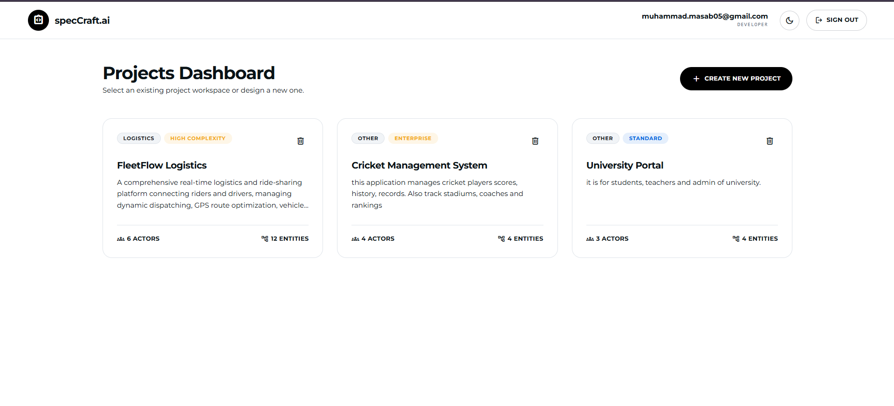
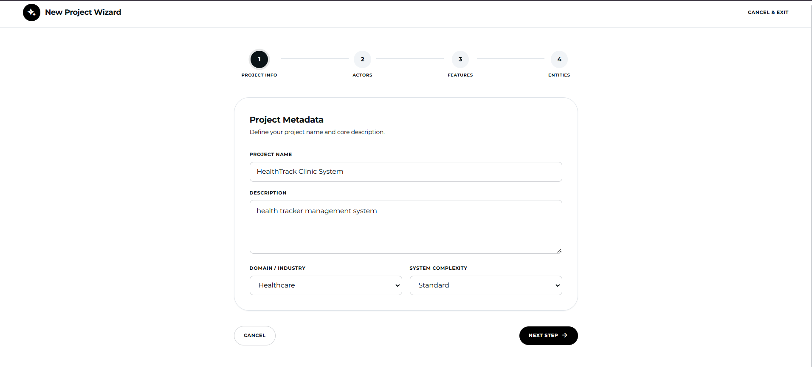
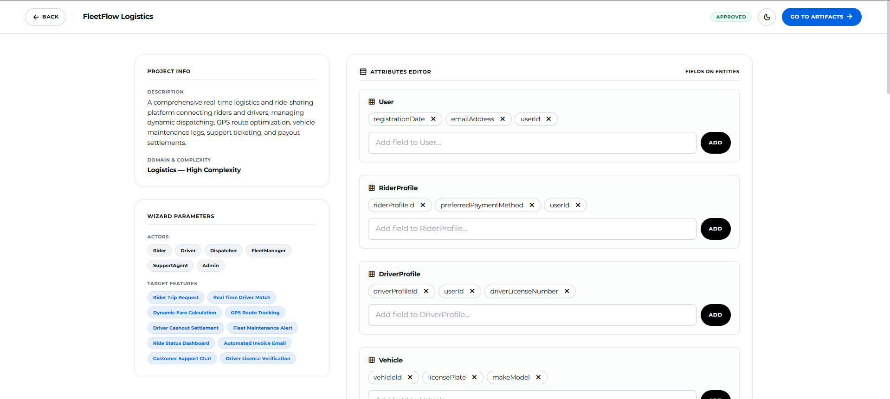
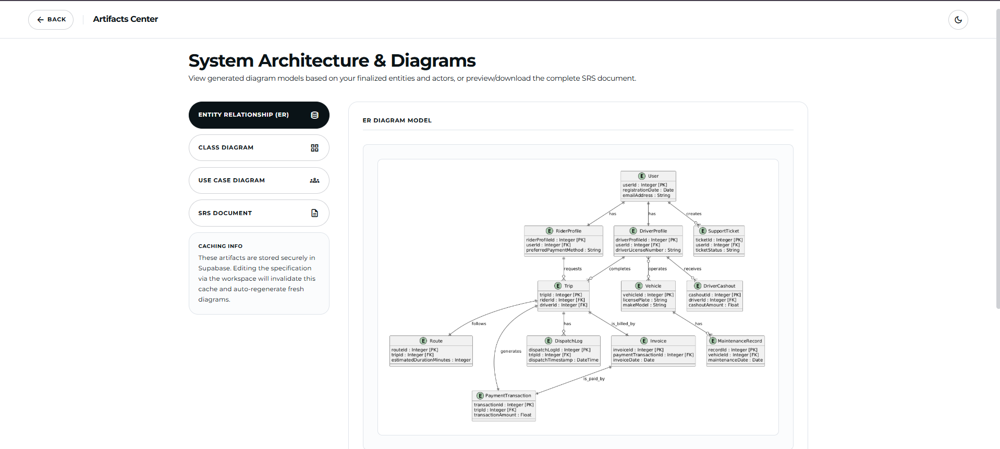
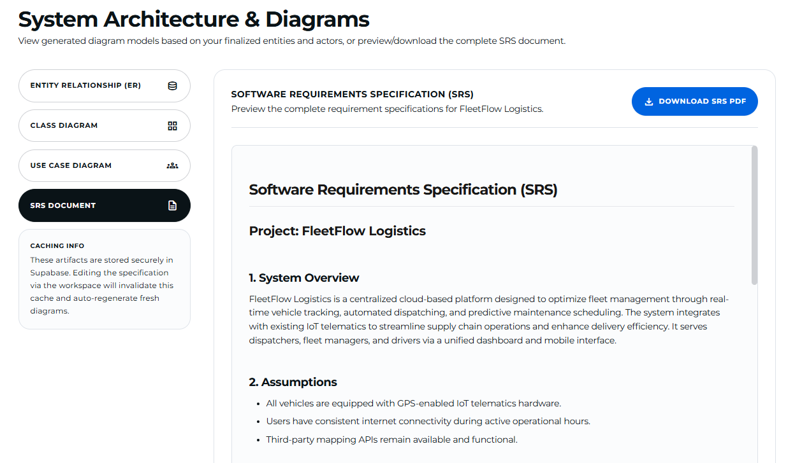

# specCraft.ai

specCraft.ai is an AI-powered systems analyst platform designed to translate high-level software ideas into complete, production-grade technical specifications. It automatically generates database schemas, structural PlantUML diagrams, and downloadable Software Requirements Specification (SRS) documents.

---

## Features

- **Interactive Project Wizard:** Guide users to define project domains, actors, target features, and core database entities.
- **AI Systems Analyst:** Automatically outputs structured entity attributes, relationships, and metadata.
- **Visual Architecture Center:** Generates and renders three core PlantUML diagrams:
  - Entity-Relationship (ER) Diagram
  - Class Diagram
  - Use Case Diagram
- **SRS Document Compiler:** Generates comprehensive Software Requirements Specification documents in markdown, with one-click PDF compilation and download.
- **Collaborative Editor:** Allows users to manually edit, refine, add, or remove database entities, attributes, and relationship links in real-time.
- **Smart Caching:** Stores generated diagrams and compiled PDFs in Supabase Storage to minimize latency and reduce redundant AI generation costs.
- **Built-in Security:** Secured with Supabase Row-Level Security (RLS) policies, client-scoped API rate limiting, and robust input validation schemas.

---

## Tech Stack

### Frontend
- **React 19 & Vite:** Core application framework and build tool.
- **Tailwind CSS:** Modern utility-first styling.
- **Supabase Client:** Handles user authentication and secure session states.

### Backend
- **Node.js & Express:** Server-side API application.
- **Gemini API (via OpenAI SDK):** AI intelligence layer for generating models and UML schemas.
- **Supabase JS (Service Role):** Interacts securely with the database bypassing RLS on trusted server environments.
- **Zod:** Strict request schema validation.
- **PDFKit & Markdown-it:** Dynamic PDF compilation and markdown parsing.
- **PlantUML Encoder:** Encodes UML syntax to interact with the public PlantUML rendering service.

---

## Screenshots

### Dashboard Overview


### Project Creation Wizard


### Interactive Workspace


### Artifacts Center & Diagrams View


---

## System Architecture

```
[ Frontend: React / Vite ]
          │
          │ HTTP Requests (Bearer JWT Token)
          ▼
[ Backend: Node.js / Express ] ────(AI Queries)────► [ Gemini API ]
          │
          ├────(Metadata / RLS Bypass)─────► [ Supabase Database ]
          │
          └────(PDF Uploads / Downloads)───► [ Supabase Storage ]
```

---

## Environment Variables

To run the application locally, you must configure the environment variables for both the backend and frontend.

### Backend Environment Variables
Create a `.env` file inside the `backend/` directory:

```env
PORT=8001
SUPABASE_URL=your_supabase_project_url
SUPABASE_ANON_KEY=your_supabase_anon_key
SUPABASE_SERVICE_ROLE_KEY=your_supabase_service_role_key
GEMINI_API_KEY=your_gemini_api_key
```

### Frontend Environment Variables
Create a `.env` file inside the `frontend/` directory:

```env
VITE_SUPABASE_URL=your_supabase_project_url
VITE_SUPABASE_ANON_KEY=your_supabase_anon_key
```

---

## Installation

Follow these steps to set up and run specCraft.ai on your local system.

### Prerequisites
- Node.js (v18 or higher recommended)
- A Supabase account and project

### Step 1: Clone the Repository
```bash
git clone https://github.com/masab2005/specCraft_AI.git
cd specCraft_AI
```

### Step 2: Set up the Backend
```bash
cd backend
npm install
# Configure your backend .env file here
npm run dev
```

### Step 3: Set up the Frontend
Open a new terminal window:
```bash
cd frontend
npm install
# Configure your frontend .env file here
npm run dev
```

The frontend application will be running at `http://localhost:5173`, and the backend server will run at `http://localhost:8001`.
